Phyloseq-state-dada
================

``` r
library(knitr)
library(markdown) 
```

\#Importer directement les tables produites par le pipeline DADA2 dans
phyloseq. Nous ajouterons également la petite quantité de métadonnées
dont nous disposons - les échantillons sont nommés par le sexe (G), le
numéro de sujet de la souris (X) et le jour après le sevrage (Y) où ils
ont été échantillonnés (par exemple GXDY).

``` r
packageVersion("phyloseq")
```

    ## [1] '1.32.0'

Le package phyloseq R est un cadre puissant pour une analyse plus
approfondie des données sur le microbiome .

``` r
BiocManager::install("Biostrings")
```

    ## Bioconductor version 3.11 (BiocManager 1.30.10), R 4.0.3 (2020-10-10)

    ## Installing package(s) 'Biostrings'

    ## Installation path not writeable, unable to update packages: codetools,
    ##   KernSmooth, nlme

le package biostring a une fonctionnalité pour la correspondance de
motifs (alignement de lecture courte) ainsi qu’une fonction d’alignement
par paires

``` r
packageVersion("Biostrings")
```

    ## [1] '2.56.0'

``` r
BiocManager::install("ggplot2")
```

    ## Bioconductor version 3.11 (BiocManager 1.30.10), R 4.0.3 (2020-10-10)

    ## Installing package(s) 'ggplot2'

    ## Installation path not writeable, unable to update packages: codetools,
    ##   KernSmooth, nlme

Le package ggplot2 est un système de création graphique déclarative,
basé sur The Grammar of Graphics . Vous fournissez les données, dites à
ggplot2 comment mapper des variables à l’esthétique, quelles primitives
graphiques utiliser et il s’occupe des détails

``` r
packageVersion("ggplot2")
```

    ## [1] '3.3.2'

\#Ca permets de voir si le package est bien installer

``` r
library("phyloseq")
```

``` r
library("Biostrings")
```

    ## Loading required package: BiocGenerics

    ## Loading required package: parallel

    ## 
    ## Attaching package: 'BiocGenerics'

    ## The following objects are masked from 'package:parallel':
    ## 
    ##     clusterApply, clusterApplyLB, clusterCall, clusterEvalQ,
    ##     clusterExport, clusterMap, parApply, parCapply, parLapply,
    ##     parLapplyLB, parRapply, parSapply, parSapplyLB

    ## The following objects are masked from 'package:stats':
    ## 
    ##     IQR, mad, sd, var, xtabs

    ## The following objects are masked from 'package:base':
    ## 
    ##     anyDuplicated, append, as.data.frame, basename, cbind, colnames,
    ##     dirname, do.call, duplicated, eval, evalq, Filter, Find, get, grep,
    ##     grepl, intersect, is.unsorted, lapply, Map, mapply, match, mget,
    ##     order, paste, pmax, pmax.int, pmin, pmin.int, Position, rank,
    ##     rbind, Reduce, rownames, sapply, setdiff, sort, table, tapply,
    ##     union, unique, unsplit, which, which.max, which.min

    ## Loading required package: S4Vectors

    ## Loading required package: stats4

    ## 
    ## Attaching package: 'S4Vectors'

    ## The following object is masked from 'package:base':
    ## 
    ##     expand.grid

    ## Loading required package: IRanges

    ## 
    ## Attaching package: 'IRanges'

    ## The following object is masked from 'package:phyloseq':
    ## 
    ##     distance

    ## Loading required package: XVector

    ## 
    ## Attaching package: 'Biostrings'

    ## The following object is masked from 'package:base':
    ## 
    ##     strsplit

``` r
library("ggplot2")
```

\#construire un échantillon simple à data.framepartir des informations
encodées dans les noms de fichiers: maintenant on regroupe tout dans un
objet phyloseq avec la commande ps (arbre phylo, table de données etc…)
exemple de l’armoire et des tiroirs. On va créer nos outils pour
l’analyse de phyloseq

\#Constriure un objet phyolseq

``` r
ps_connect <-url("https://raw.githubusercontent.com/spholmes/F1000_workflow/master/data/ps.rds")
ps = readRDS(ps_connect)
ps
```

    ## phyloseq-class experiment-level object
    ## otu_table()   OTU Table:         [ 389 taxa and 360 samples ]
    ## sample_data() Sample Data:       [ 360 samples by 14 sample variables ]
    ## tax_table()   Taxonomy Table:    [ 389 taxa by 6 taxonomic ranks ]
    ## phy_tree()    Phylogenetic Tree: [ 389 tips and 387 internal nodes ]

\#Créeation d’un tableau des nombres de lectures pour chaque phylum
présent dans l’ensemble de données. \#\# Show available ranks in the
dataset

``` r
rank_names(ps)
```

    ## [1] "Kingdom" "Phylum"  "Class"   "Order"   "Family"  "Genus"

# Create table, number of features for each phyla

``` r
table(tax_table(ps)[, "Phylum"], exclude = NULL)
```

    ## 
    ##              Actinobacteria               Bacteroidetes 
    ##                          13                          23 
    ## Candidatus_Saccharibacteria   Cyanobacteria/Chloroplast 
    ##                           1                           4 
    ##         Deinococcus-Thermus                  Firmicutes 
    ##                           1                         327 
    ##                Fusobacteria              Proteobacteria 
    ##                           1                          11 
    ##                 Tenericutes             Verrucomicrobia 
    ##                           1                           1 
    ##                        <NA> 
    ##                           6

On a quelques phylums pour lesquels une seule caractéristique a été
observée. Cela vaut peut-être la peine d’être filtré, et nous
vérifierons cela ensuite. Tout d’abord, notez que dans ce cas, six
caractéristiques ont été annotées avec un Phylum of NA. Ces
fonctionnalités sont probablement des artefacts dans un ensemble de
données comme celui-ci et doivent être supprimées.

\#garantir que les fonctionnalités avec une annotation de phylum ambiguë
sont également supprimées. Notez la flexibilité dans la définition des
chaînes qui doivent être considérées comme des annotations ambiguës.

``` r
ps <- subset_taxa(ps, !is.na(Phylum) & !Phylum %in% c("", "uncharacterized"))
```

\#Explorer la prévalence des caractéristiques dans l’ensemble de
données, que nous définirons ici comme le nombre d’échantillons dans
lesquels un taxon apparaît au moins une fois.

``` r
# Compute prevalence of each feature, store as data.frame
prevdf = apply(X = otu_table(ps),
               MARGIN = ifelse(taxa_are_rows(ps), yes = 1, no = 2),
               FUN = function(x){sum(x > 0)})
# Add taxonomy and total read counts to this data.frame
prevdf = data.frame(Prevalence = prevdf,
                    TotalAbundance = taxa_sums(ps),
                    tax_table(ps))
```

\#Calcule rles prévalences totales et moyennes des caractéristiques dans
chaque phylum pour voir est-ce qu’il y a des phylums composés
principalement de caractéristiques à faible prévalence.

``` r
plyr::ddply(prevdf, "Phylum", function(df1){cbind(mean(df1$Prevalence),sum(df1$Prevalence))})
```

    ##                         Phylum         1     2
    ## 1               Actinobacteria 120.15385  1562
    ## 2                Bacteroidetes 265.52174  6107
    ## 3  Candidatus_Saccharibacteria 280.00000   280
    ## 4    Cyanobacteria/Chloroplast  64.25000   257
    ## 5          Deinococcus-Thermus  52.00000    52
    ## 6                   Firmicutes 179.24771 58614
    ## 7                 Fusobacteria   2.00000     2
    ## 8               Proteobacteria  59.09091   650
    ## 9                  Tenericutes 234.00000   234
    ## 10             Verrucomicrobia 104.00000   104

Deinococcus-Thermus est apparu dans un peu plus d’un pour cent des
échantillons, et les fusobactéries sont apparues dans seulement 2
échantillons au total. Dans certains cas, il pourrait être intéressant
d’explorer ces deux phylums plus en détail malgré cela (mais
probablement pas les deux échantillons de Fusobacteria). Pour les
besoins de cet exemple, cependant, ils seront filtrés de l’ensemble de
données.

# Define phyla to filter

``` r
filterPhyla = c("Fusobacteria", "Deinococcus-Thermus")
# Filter entries with unidentified Phylum.
ps1 = subset_taxa(ps, !Phylum %in% filterPhyla)
ps1
```

    ## phyloseq-class experiment-level object
    ## otu_table()   OTU Table:         [ 381 taxa and 360 samples ]
    ## sample_data() Sample Data:       [ 360 samples by 14 sample variables ]
    ## tax_table()   Taxonomy Table:    [ 381 taxa by 6 taxonomic ranks ]
    ## phy_tree()    Phylogenetic Tree: [ 381 tips and 379 internal nodes ]

\#Filtrage de la prévalence \#\# Les étapes de filtrage précédentes sont
considérées comme supervisées.Cette prochaine étape de filtrage est
complètement non supervisée , ne reposant que sur les données de cette
expérience et sur un paramètre que nous choisirons après avoir exploré
les données.

``` r
# Subset to the remaining phyla
prevdf1 = subset(prevdf, Phylum %in% get_taxa_unique(ps1, "Phylum"))
ggplot(prevdf1, aes(TotalAbundance, Prevalence / nsamples(ps),color=Phylum)) +
  # Include a guess for parameter
  geom_hline(yintercept = 0.05, alpha = 0.5, linetype = 2) +  geom_point(size = 2, alpha = 0.7) +
  scale_x_log10() +  xlab("Total Abundance") + ylab("Prevalence [Frac. Samples]") +
  facet_wrap(~Phylum) + theme(legend.position="none")
```

<!-- -->
Chaque point de la figure est un taxon différent. L’exploration des
données de cette manière est souvent utile pour sélectionner les
paramètres de filtrage, comme les critères de prévalence minimale que
nous utiliserons pour filtrer les données ci-dessus. aucune séparation
naturelle n’est immédiatement évidente, mais il semble que nous
pourrions raisonnablement définir un seuil de prévalence dans une
fourchette de zéro à dix pour cent environ. Veillez à ce que ce choix
n’introduise pas de biais dans une analyse en aval de l’association de
l’abondance différentielle.

\#Utiliser cinq pour cent de tous les échantillons comme seuil de
prévalence

``` r
# Define prevalence threshold as 5% of total samples
prevalenceThreshold = 0.05 * nsamples(ps)
prevalenceThreshold
```

    ## [1] 18

``` r
# Execute prevalence filter, using `prune_taxa()` function
keepTaxa = rownames(prevdf1)[(prevdf1$Prevalence >= prevalenceThreshold)]
ps2 = prune_taxa(keepTaxa, ps)
```

\#Filtrage de la prévalence \#\#Montrer comment combiner toutes les
fonctionnalités qui descendent du même genre.

``` r
# How many genera would be present after filtering?
length(get_taxa_unique(ps2, taxonomic.rank = "Genus"))
```

    ## [1] 49

``` r
ps3 = tax_glom(ps2, "Genus", NArm = TRUE)
```

Si la taxonomie n’est pas disponible ou n’est pas fiable,
l’agglomération arborescente est une alternative «sans taxonomie»
pour combiner des caractéristiques de données correspondant à des taxons
étroitement liés. Dans ce cas, plutôt que le rang taxonomique,
l’utilisateur spécifie une hauteur d’arbre correspondant à la distance
phylogénétique entre les entités qui doivent définir leur regroupement.
Ceci est très similaire au «clustering OTU», sauf que dans de nombreux
algorithmes de clustering OTU, la distance de séquence utilisée n’a pas
la même (ou aucune) définition évolutive.

``` r
h1 = 0.4
ps4 = tip_glom(ps2, h = h1)
```

Ici, la plot\_tree()fonction de phyloseq compare les données originales
non filtrées, l’arbre après l’agglomération taxonoïque et l’arbre après
l’agglomération phylogénétique. Ceux-ci sont stockés en tant qu’objets
de tracé séparés, puis rendus ensemble dans un graphique combiné à
l’aide de gridExtra::grid.arrange.

``` r
multiPlotTitleTextSize = 15
p2tree = plot_tree(ps2, method = "treeonly",
                   ladderize = "left",
                   title = "Before Agglomeration") +
  theme(plot.title = element_text(size = multiPlotTitleTextSize))
p3tree = plot_tree(ps3, method = "treeonly",
                   ladderize = "left", title = "By Genus") +
  theme(plot.title = element_text(size = multiPlotTitleTextSize))
p4tree = plot_tree(ps4, method = "treeonly",
                   ladderize = "left", title = "By Height") +
  theme(plot.title = element_text(size = multiPlotTitleTextSize))
```

``` r
library ("gridExtra") 
```

    ## 
    ## Attaching package: 'gridExtra'

    ## The following object is masked from 'package:BiocGenerics':
    ## 
    ##     combine

``` r
grid.arrange(nrow = 1, p2tree, p3tree, p4tree)
```

<!-- --> La
figure montre l’arbre original à gauche, l’agglomération taxonomique au
rang de genre au milieu et l’agglomération phylogénétique à une distance
fixe de 0,4 à droite.

\#Transformation de la valeur d’abondance \#\#définir une fonction de
tracé personnalisée plot\_abundance(),, qui utilise la fonction de
phyloseq pour définir un graphique d’abondance relative. Nous
l’utiliserons pour comparer plus facilement les différences d’échelle
et de distribution des valeurs d’abondance dans notre objet phyloseq
avant et après transformation.

``` r
plot_abundance = function(physeq,title = "",
                          Facet = "Order", Color = "Phylum"){
  # Arbitrary subset, based on Phylum, for plotting
  p1f = subset_taxa(physeq, Phylum %in% c("Firmicutes"))
  mphyseq = psmelt(p1f)
  mphyseq <- subset(mphyseq, Abundance > 0)
  ggplot(data = mphyseq, mapping = aes_string(x = "sex",y = "Abundance",
                              color = Color, fill = Color)) +
    geom_violin(fill = NA) +
    geom_point(size = 1, alpha = 0.3,
               position = position_jitter(width = 0.3)) +
    facet_wrap(facets = Facet) + scale_y_log10()+
    theme(legend.position="none")
}
```

La transformation dans ce cas convertit les dénombrements de chaque
échantillon en leurs fréquences, souvent appelées proportions ou
abondances relatives . Cette fonction est si simple qu’il est plus
facile de la définir dans l’appel de fonction à
transform\_sample\_counts().

``` r
# Transform to relative abundance. Save as new object.
ps3ra = transform_sample_counts(ps3, function(x){x / sum(x)})
```

\#Traçer les valeurs d’abondance avant et après la transformation.

``` r
plotBefore = plot_abundance(ps3,"")
plotAfter = plot_abundance(ps3ra,"")
# Combine each plot into one graphic.
grid.arrange(nrow = 2,  plotBefore, plotAfter)
```

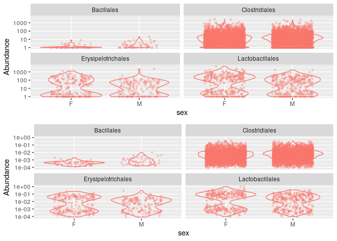<!-- --> La
figure montre la comparaison des abondances d’origine (panneau
supérieur) et des abondances relatives (inférieure).

\#Sous-ensemble par taxonomie \#\#sous-ensembles avec la fonction, puis
spécifions un rang taxonomique plus précis à l’argument de la fonction
que nous avons définie ci-dessus.

``` r
psOrd = subset_taxa(ps3ra, Order == "Lactobacillales")
plot_abundance(psOrd, Facet = "Genus", Color = NULL)
```

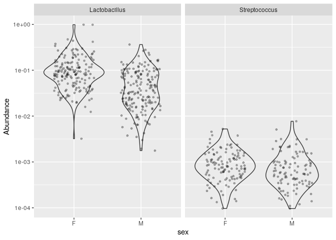<!-- --> La
figure montre les abondances relatives de l’ordre taxonomique des
Lactobacillales, regroupées par sexe et genre d’hôte. Ici, il est clair
que la distribution biomodale apparente des Lactobacillales sur la
parcelle précédente était le résultat d’un mélange de deux genres
différents, avec l’ abondance relative typique de Lactobacillus
beaucoup plus grande que Streptococcus

\#Installer quelques packages disponibles pour ces analyses
complémentaires

``` r
.cran_packages <- c( "shiny","miniUI", "caret", "pls", "e1071", "ggplot2", "randomForest", "dplyr", "ggrepel", "nlme", "devtools",
                  "reshape2", "PMA", "structSSI", "ade4",
                  "ggnetwork", "intergraph", "scales")
.github_packages <- c("jfukuyama/phyloseqGraphTest")
.bioc_packages <- c("genefilter", "impute")
# Install CRAN packages (if not already installed)
.inst <- .cran_packages %in% installed.packages()
if (any(!.inst)){
  install.packages(.cran_packages[!.inst],repos = "http://cran.rstudio.com/")
}
.inst <- .github_packages %in% installed.packages()
if (any(!.inst)){
  devtools::install_github(.github_packages[!.inst])
}
```

    ## Skipping install of 'phyloseqGraphTest' from a github remote, the SHA1 (3fb6c274) has not changed since last install.
    ##   Use `force = TRUE` to force installation

``` r
.inst <- .bioc_packages %in% installed.packages()
if(any(!.inst)){
  source("http://bioconductor.org/biocLite.R")
  biocLite(.bioc_packages[!.inst])
}
```

\#Prétraitement \#\#enregistrer également le nombre total de
dénombrements observés dans chaque échantillon et transformer données
en logarithme sous forme de transformation de stabilisation de la
variance approximative.

``` r
qplot(sample_data(ps)$age, geom = "histogram",binwidth=20) + xlab("age")
```

<!-- --> La
figure montre que la covariable d’âge appartient à trois grappes
distinctes.

``` r
qplot(log10(rowSums(otu_table(ps))),binwidth=0.2) +
  xlab("Logged counts-per-sample")
```

<!-- --> Ces
graphiques préliminaires suggèrent certaines étapes de prétraitement.
L’histogramme de la figure précédente motive la création d’une
nouvelle variable catégorielle, regroupant l’âge dans l’un des trois
pics.

L’histogramme de cette figure suggère qu’unJournal( 1 + x )la
transformation pourrait être suffisante pour normalizingles données
d’abondance pour les analyses exploratoires.

En fait, cette transformation n’est pas suffisante à des fins de test et
lors de l’exécution d’abondances différentielles, nous recommandons les
transformations de stabilisation de la variance disponibles dans DESeq2
via la phyloseq\_to\_deseq2fonction, voir le tutoriel
phyloseq\_to\_deseq2 ici

# Examiner l’analyse des coordonnées principales (PCoA) avec soit la dissemblance Bray-Curtis sur la distance Unifrac pondérée

``` r
sample_data(ps)$age_binned <- cut(sample_data(ps)$age,
                          breaks = c(0, 100, 200, 400))
levels(sample_data(ps)$age_binned) <- list(Young100="(0,100]", Mid100to200="(100,200]", Old200="(200,400]")
sample_data(ps)$family_relationship=gsub(" ","",sample_data(ps)$family_relationship)
pslog <- transform_sample_counts(ps, function(x) log(1 + x))
out.wuf.log <- ordinate(pslog, method = "MDS", distance = "wunifrac")
```

    ## Warning in UniFrac(physeq, weighted = TRUE, ...): Randomly assigning root as --
    ## GCAAGCGTTATCCGGATTTACTGGGTGTAAAGGGGGCGCAGACGGCCATGGCAAGCCCGGTGTGAAAGGCAGGGGCATAACCCCTGGACTGCACTGGGAACTGTCAGGCTGGAGTGCCGGAGGGGTAAGCGGAATTCCTGGTGTAGCGGTGAAATGCGTAGATATCAGGAGGAACACCGGCGGCGAAGGCGGCTTACTGGACGGCAACTGACGTTGAGGCCCGAAAGCGTGGGGA
    ## -- in the phylogenetic tree in the data you provided.

``` r
evals <- out.wuf.log$values$Eigenvalues
plot_ordination(pslog, out.wuf.log, color = "age_binned") +
  labs(col = "Binned Age") +
  coord_fixed(sqrt(evals[2] / evals[1]))
```

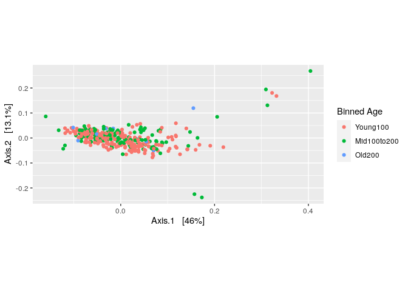<!-- -->

La figure montre l’ordination sur les données d’abondance enregistrées
révèle quelques valeurs aberrantes.

Il s’agit des échantillons des femelles 5 et 6 au jour 165 et des
échantillons des mâles 3, 4, 5 et 6 au jour 175. Nous les retirerons,
car nous nous intéressons principalement aux relations entre les non-
points aberrants

\#Vérifier les deux valeurs aberrantes féminines - elles ont été
reprises par le même OTU / ASV, qui a une abondance relative de plus de
90% dans chacune d’elles.

``` r
rel_abund <- t(apply(otu_table(ps), 1, function(x) x / sum(x)))
qplot(rel_abund[, 12], geom = "histogram",binwidth=0.05) +
  xlab("Relative abundance")
```

<!-- -->

\#Différentes projections d’ordination \#\#calculer les ordinations avec
ces valeurs aberrantes supprimées et étudier plus attentivement la
sortie.

``` r
outliers <- c("F5D165", "F6D165", "M3D175", "M4D175", "M5D175", "M6D175")
ps <- prune_samples(!(sample_names(ps) %in% outliers), ps)
```

\#\#supprimer les échantillons avec moins de 1000 lectures:

``` r
which(!rowSums(otu_table(ps)) > 1000)
```

    ## F5D145 M1D149   M1D9 M2D125  M2D19 M3D148 M3D149   M3D3   M3D5   M3D8 
    ##     69    185    200    204    218    243    244    252    256    260

``` r
ps <- prune_samples(rowSums(otu_table(ps)) > 1000, ps)
pslog <- transform_sample_counts(ps, function(x) log(1 + x))
```

\#\#effectuer un PCoA en utilisant la dissemblance Bray-Curtis

``` r
out.pcoa.log <- ordinate(pslog,  method = "MDS", distance = "bray")
evals <- out.pcoa.log$values[,1]
plot_ordination(pslog, out.pcoa.log, color = "age_binned",
                  shape = "family_relationship") +
  labs(col = "Binned Age", shape = "Litter")+
  coord_fixed(sqrt(evals[2] / evals[1]))
```

<!-- --> On
voit qu’il y a un effet d’âge assez important qui est cohérent entre
toutes les souris, mâles et femelles, et de portées différentes.

\#\#examiner l’analyse des coordonnées principales doubles (DPCoA)
(Pavoine, Dufour et Chessel 2004; Purdom 2010; Fukuyama et al.2012 ) ,
qui est une méthode d’ordination phylogénétique et qui fournit une
représentation biplot des échantillons et des catégories taxonomiques.
Nous voyons à nouveau que le deuxième axe correspond aux souris jeunes
vs âgées, et le biplot suggère une interprétation du deuxième axe: les
échantillons qui ont des scores plus élevés sur le deuxième axe ont
plus de taxons de Bacteroidetes et un sous-ensemble de Firmicutes.

``` r
out.dpcoa.log <- ordinate(pslog, method = "DPCoA")
evals <- out.dpcoa.log$eig
plot_ordination(pslog, out.dpcoa.log, color = "age_binned", label= "SampleID",
                  shape = "family_relationship") +
  labs(col = "Binned Age", shape = "Litter")+
  coord_fixed(sqrt(evals[2] / evals[1]))
```

<!-- --> Sur
la figure nous avons le premier axe qui explique 75% de la variabilité,
environ 9 fois celle du deuxième axe; cela se traduit par la forme
allongée du tracé d’ordination.

\#Regarder les résultats du PCoA avec Unifrac pondéré. Comme
précédemment, nous constatons que le deuxième axe est associé à un
effet d’âge, assez similaire au DPCoA. Cela n’est pas surprenant, car
les deux sont des méthodes d’ordination phylogénétique prenant en compte
l’abondance. Cependant, lorsque nous comparons les biplots, nous voyons
que le DPCoA a donné une interprétation beaucoup plus claire du deuxième
axe, par rapport à l’Unifrac pondéré.

``` r
plot_ordination(pslog, out.dpcoa.log, type = "species", color = "Phylum") +
  coord_fixed(sqrt(evals[2] / evals[1]))
```

<!-- -->

``` r
out.wuf.log <- ordinate(pslog, method = "PCoA", distance ="wunifrac")
```

    ## Warning in UniFrac(physeq, weighted = TRUE, ...): Randomly assigning root as --
    ## GCAAGCGTTATCCGGATTTACTGGGTGTAAAGGGAGCGCAGGCGGCGCGTTAAGCCTGGTGTGAAAGCCCGCGGCCCAACCGCGGGACTGCATTGGGAACTGGCGCGCTGGAGTGCCGGAGGGGTAGGCGGAATTCCTAGTGTAGCGGTGAAATGCGTAGATATTAGGAGGAACACCAGTGGCGAAGGCGGCCTACTGGACGGTGACTGACGCTGAGGCTCGAAAGCGTGGGGAG
    ## -- in the phylogenetic tree in the data you provided.

``` r
evals <- out.wuf.log$values$Eigenvalues
plot_ordination(pslog, out.wuf.log, color = "age_binned",
                  shape = "family_relationship") +
  coord_fixed(sqrt(evals[2] / evals[1])) +
  labs(col = "Binned Age", shape = "Litter")
```

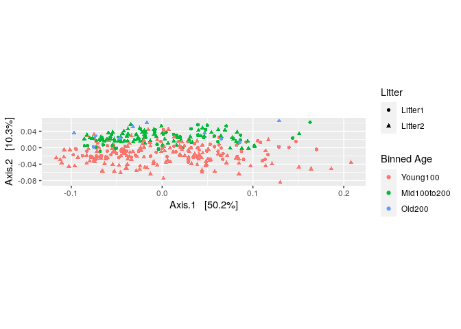<!-- -->

\#PCA sur les rangs \#\#créer une nouvelle matrice, représentant les
abondances par leurs rangs, où le microbe avec le plus petit dans un
échantillon est mappé au rang 1, au deuxième rang le plus petit 2, etc.

``` r
abund <- otu_table(pslog)
abund_ranks <- t(apply(abund, 1, rank))
```

L’utilisation naïve de ces classements pourrait rendre comparables les
différences entre les paires de microbes à faible et à forte abondance.
Dans le cas où de nombreuses bactéries sont absentes ou présentes à
l’état de traces, une différence de rang artificiellement importante
pourrait se produire (Holmes et al. 2011) pour les taxons peu abondants.
Pour éviter cela, tous les microbes dont le rang est inférieur à un
certain seuil doivent être liés à 1. Les rangs des autres microbes sont
décalés vers le bas, il n’y a donc pas de grand écart entre les rangs.

``` r
abund_ranks <- abund_ranks - 329
abund_ranks[abund_ranks < 1] <- 1
```

``` r
library(dplyr)
```

    ## 
    ## Attaching package: 'dplyr'

    ## The following object is masked from 'package:gridExtra':
    ## 
    ##     combine

    ## The following objects are masked from 'package:Biostrings':
    ## 
    ##     collapse, intersect, setdiff, setequal, union

    ## The following object is masked from 'package:XVector':
    ## 
    ##     slice

    ## The following objects are masked from 'package:IRanges':
    ## 
    ##     collapse, desc, intersect, setdiff, slice, union

    ## The following objects are masked from 'package:S4Vectors':
    ## 
    ##     first, intersect, rename, setdiff, setequal, union

    ## The following objects are masked from 'package:BiocGenerics':
    ## 
    ##     combine, intersect, setdiff, union

    ## The following objects are masked from 'package:stats':
    ## 
    ##     filter, lag

    ## The following objects are masked from 'package:base':
    ## 
    ##     intersect, setdiff, setequal, union

``` r
library(reshape2)
abund_df <- melt(abund, value.name = "abund") %>%
  left_join(melt(abund_ranks, value.name = "rank"))
```

    ## Joining, by = c("Var1", "Var2")

``` r
colnames(abund_df) <- c("sample", "seq", "abund", "rank")

abund_df <- melt(abund, value.name = "abund") %>%
  left_join(melt(abund_ranks, value.name = "rank"))
```

    ## Joining, by = c("Var1", "Var2")

``` r
colnames(abund_df) <- c("sample", "seq", "abund", "rank")

sample_ix <- sample(1:nrow(abund_df), 8)
ggplot(abund_df %>%
         filter(sample %in% abund_df$sample[sample_ix])) +
  geom_point(aes(x = abund, y = rank, col = sample),
             position = position_jitter(width = 0.2), size = 1.5) +
  labs(x = "Abundance", y = "Thresholded rank") +
  scale_color_brewer(palette = "Set2")
```

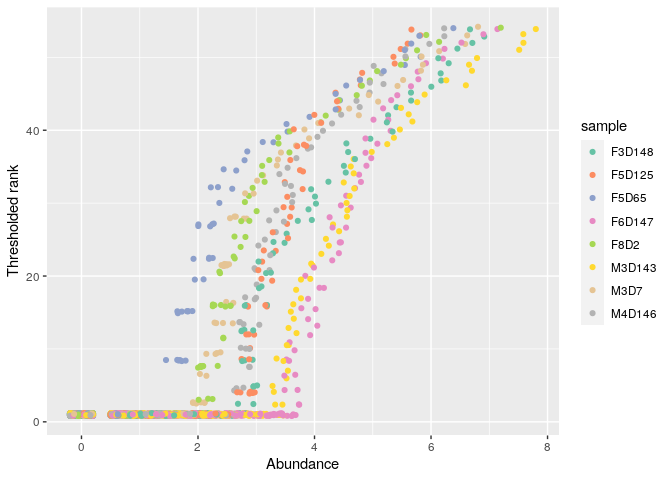<!-- -->
Cette transformation est illustrée à la figure : l’association entre
l’abondance et le rang, pour quelques échantillons choisis au hasard.
Les nombres dey-axis sont ceux fournis à PCA.

\#Effectuer une PCA et étudier le biplot résultant, donné dans la figure
ci-dessous. Pour produire une annotation pour cette figure, nous avons
utilisé le bloc suivant.

``` r
library(ade4)
```

    ## 
    ## Attaching package: 'ade4'

    ## The following object is masked from 'package:Biostrings':
    ## 
    ##     score

    ## The following object is masked from 'package:BiocGenerics':
    ## 
    ##     score

``` r
ranks_pca <- dudi.pca(abund_ranks, scannf = F, nf = 3)
row_scores <- data.frame(li = ranks_pca$li,
                         SampleID = rownames(abund_ranks))
col_scores <- data.frame(co = ranks_pca$co,
                         seq = colnames(abund_ranks))
tax <- tax_table(ps) %>%
  data.frame(stringsAsFactors = FALSE)
tax$seq <- rownames(tax)
main_orders <- c("Clostridiales", "Bacteroidales", "Lactobacillales",
                 "Coriobacteriales")
tax$Order[!(tax$Order %in% main_orders)] <- "Other"
tax$Order <- factor(tax$Order, levels = c(main_orders, "Other"))
tax$otu_id <- seq_len(ncol(otu_table(ps)))
row_scores <- row_scores %>%
  left_join(sample_data(pslog))
```

    ## Joining, by = "SampleID"

    ## Warning in class(x) <- c(setdiff(subclass, tibble_class), tibble_class): Setting
    ## class(x) to multiple strings ("tbl_df", "tbl", ...); result will no longer be an
    ## S4 object

``` r
col_scores <- col_scores %>%
  left_join(tax)
```

    ## Joining, by = "seq"

``` r
evals_prop <- 100 * (ranks_pca$eig / sum(ranks_pca$eig))
ggplot() +
  geom_point(data = row_scores, aes(x = li.Axis1, y = li.Axis2), shape = 2) +
  geom_point(data = col_scores, aes(x = 25 * co.Comp1, y = 25 * co.Comp2, col = Order),
             size = .3, alpha = 0.6) +
  scale_color_brewer(palette = "Set2") +
  facet_grid(~ age_binned) +
  guides(col = guide_legend(override.aes = list(size = 3))) +
  labs(x = sprintf("Axis1 [%s%% variance]", round(evals_prop[1], 2)),
       y = sprintf("Axis2 [%s%% variance]", round(evals_prop[2], 2))) +
  coord_fixed(sqrt(ranks_pca$eig[2] / ranks_pca$eig[1])) +
  theme(panel.border = element_rect(color = "#787878", fill = alpha("white", 0)))
```

<!-- --> Les
résultats sont similaires aux analyses PCoA calculées sans appliquer une
transformation de classement tronqué, renforçant notre confiance dans
l’analyse sur les données d’origine.

\#Pour utiliser des échantillons de données supplémentaires, il est
nécessaire de fournir un argument supplémentaire, spécifiant les
caractéristiques à prendre en compte - sinon, par défaut, toutes les
mesures sont utilisées lors de la production de l’ordination.

``` r
ps_ccpna <- ordinate(pslog, "CCA", formula = pslog ~ age_binned + family_relationship)
```

afin d’accéder aux positions du biplot, nous pouvons utiliser la
fonction ordinatedans phyloseq. De plus, pour faciliter l’annotation des
figures, nous joignons également les scores du site avec les données
environnementales dans la fente. Sur les 23 ordres taxonomiques totaux,
nous n’annotons explicitement que les quatre plus abondants - cela rend
le biplot plus facile à lire.

``` r
library(ggrepel)
ps_scores <- vegan::scores(ps_ccpna)
sites <- data.frame(ps_scores$sites)
sites$SampleID <- rownames(sites)
sites <- sites %>%
  left_join(sample_data(ps))
```

    ## Joining, by = "SampleID"

    ## Warning in class(x) <- c(setdiff(subclass, tibble_class), tibble_class): Setting
    ## class(x) to multiple strings ("tbl_df", "tbl", ...); result will no longer be an
    ## S4 object

``` r
species <- data.frame(ps_scores$species)
species$otu_id <- seq_along(colnames(otu_table(ps)))
species <- species %>%
  left_join(tax)
```

    ## Joining, by = "otu_id"

``` r
evals_prop <- 100 * ps_ccpna$CCA$eig[1:2] / sum(ps_ccpna$CA$eig)
ggplot() +
  geom_point(data = sites, aes(x = CCA1, y = CCA2), shape = 2, alpha = 0.5) +
  geom_point(data = species, aes(x = CCA1, y = CCA2, col = Order), size = 0.5) +
  geom_text_repel(data = species %>% filter(CCA2 < -2),
                    aes(x = CCA1, y = CCA2, label = otu_id),
            size = 1.5, segment.size = 0.1) +
  facet_grid(. ~ family_relationship) +
  guides(col = guide_legend(override.aes = list(size = 3))) +
  labs(x = sprintf("Axis1 [%s%% variance]", round(evals_prop[1], 2)),
        y = sprintf("Axis2 [%s%% variance]", round(evals_prop[2], 2))) +
  scale_color_brewer(palette = "Set2") +
  coord_fixed(sqrt(ps_ccpna$CCA$eig[2] / ps_ccpna$CCA$eig[1])*0.45   ) +
  theme(panel.border = element_rect(color = "#787878", fill = alpha("white", 0)))
```

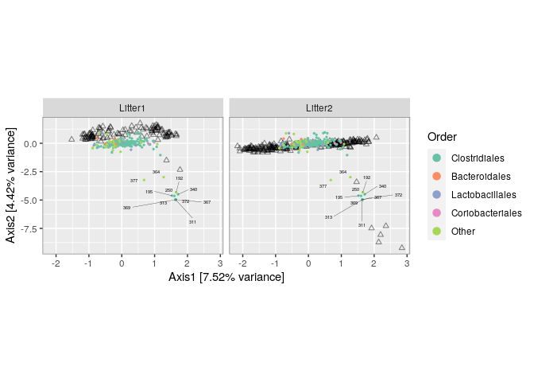<!-- -->

\#Enseignement supervisé \#\# illustrer quelques méthodes
d’apprentissage supervisé qui peuvent être facilement exécutées dans
R. Diviser les données en ensembles d’apprentissage et de test, les
affectations étant effectuées à la souris plutôt que par échantillon,

``` r
library(caret)
```

    ## Loading required package: lattice

``` r
sample_data(pslog)$age2 <- cut(sample_data(pslog)$age, c(0, 100, 400))
dataMatrix <- data.frame(age = sample_data(pslog)$age2, otu_table(pslog))
# take 8 mice at random to be the training set, and the remaining 4 the test set
trainingMice <- sample(unique(sample_data(pslog)$host_subject_id), size = 8)
inTrain <- which(sample_data(pslog)$host_subject_id %in% trainingMice)
training <- dataMatrix[inTrain,]
testing <- dataMatrix[-inTrain,]
plsFit <- train(age ~ ., data = training,
                method = "pls", preProc = "center")
```

\#\#Prédire les étiquettes de classe sur l’ensemble de test en utilisant
la fonction predictet comparer à la vérité. Nous voyons que la méthode
fait un excellent travail de prédiction de l’âge.

``` r
plsClasses <- predict(plsFit, newdata = testing)
table(plsClasses, testing$age)
```

    ##            
    ## plsClasses  (0,100] (100,400]
    ##   (0,100]        68         0
    ##   (100,400]       4        45

Comme autre exemple, nous pouvons essayer des forêts aléatoires. Ceci
est exécuté exactement de la même manière que PLS, en basculant
l’argument de à. Les forêts aléatoires se comportent également bien à
la tâche de prédiction sur cet ensemble de test, bien qu’il y ait plus
de vieilles souris mal classées comme jeunes.

``` r
library(randomForest)
```

    ## randomForest 4.6-14

    ## Type rfNews() to see new features/changes/bug fixes.

    ## 
    ## Attaching package: 'randomForest'

    ## The following object is masked from 'package:dplyr':
    ## 
    ##     combine

    ## The following object is masked from 'package:gridExtra':
    ## 
    ##     combine

    ## The following object is masked from 'package:ggplot2':
    ## 
    ##     margin

    ## The following object is masked from 'package:BiocGenerics':
    ## 
    ##     combine

``` r
rfFit <- train(age ~ ., data = training, method = "rf",
               preProc = "center", proximity = TRUE)
rfClasses <- predict(rfFit, newdata = testing)
table(rfClasses, testing$age)
```

    ##            
    ## rfClasses   (0,100] (100,400]
    ##   (0,100]        70         0
    ##   (100,400]       2        45

Pour interpréter ces PLS et les résultats aléatoires de la forêt, il est
standard de produire respectivement des biplots et des graphiques de
proximité. Le code ci-dessous extrait les coordonnées et fournit des
annotations pour les points à inclure sur le biplot PLS.

\#To interpret these PLS and random forest results, it is standard to
produce biplots and proximity plots, respectively. The code below
extracts coordinates and supplies annotation for points to include on
the PLS biplot.

``` r
library(vegan)
```

    ## Loading required package: permute

    ## This is vegan 2.5-6

    ## 
    ## Attaching package: 'vegan'

    ## The following object is masked from 'package:caret':
    ## 
    ##     tolerance

``` r
library(phyloseq)
library(dplyr)
pls_biplot <- list("loadings" = loadings(plsFit$finalModel),
                   "scores" = scores(plsFit$finalModel))
class(pls_biplot$scores) <- "matrix"

pls_biplot$scores <- data.frame(sample_data(pslog)[inTrain, ],
                                pls_biplot$scores)

tax <- tax_table(ps)@.Data %>% data.frame(stringsAsFactors = FALSE)
main_orders <- c("Clostridiales", "Bacteroidales", "Lactobacillales",
                 "Coriobacteriales")
tax$Order[!(tax$Order %in% main_orders)] <- "Other"
tax$Order <- factor(tax$Order, levels = c(main_orders, "Other"))
class(pls_biplot$loadings) <- "matrix"
pls_biplot$loadings <- data.frame(tax, pls_biplot$loadings)
```

``` r
library(viridisLite)
ggplot() +
  geom_point(data = pls_biplot$scores,
             aes(x = Comp.1, y = Comp.2), shape = 2) +
  geom_point(data = pls_biplot$loadings,
             aes(x = 25 * Comp.1, y = 25 * Comp.2, col = Order),
             size = 0.3, alpha = 0.6) +
  scale_color_brewer(palette = "Set2") +
  labs(x = "Axis1", y = "Axis2", col = "Binned Age") +
  guides(col = guide_legend(override.aes = list(size = 3))) +
  facet_grid( ~ age2) +
  theme(panel.border = element_rect(color = "#787878", fill = alpha("white", 0)))
```

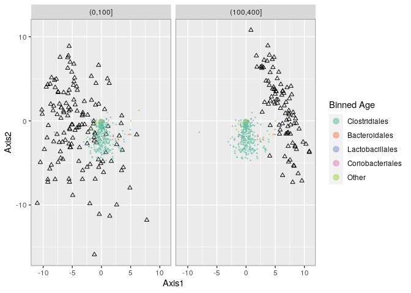<!-- --> Le
biplot résultant est affiché sur la figure ; il peut être interprété de
la même manière que les diagrammes d’ordination antérieurs, à
l’exception du fait que la projection est choisie avec une référence
explicite à la variable d’âge regroupée. Plus précisément, PLS identifie
un sous-espace pour maximiser la discrimination entre les classes, et le
biplot affiche des projections d’échantillons et des coefficients ASV
par rapport à ce sous-espace.

``` r
rf_prox <- cmdscale(1 - rfFit$finalModel$proximity) %>%
  data.frame(sample_data(pslog)[inTrain, ])

ggplot(rf_prox) +
  geom_point(aes(x = X1, y = X2, col = age_binned),
             size = 1, alpha = 0.7) +
  scale_color_manual(values = c("#A66EB8", "#238DB5", "#748B4F")) +
  guides(col = guide_legend(override.aes = list(size = 4))) +
  labs(col = "Binned Age", x = "Axis1", y = "Axis2")
```

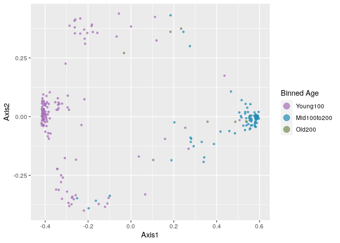<!-- --> Le
biplot résultant est affiché sur la figure 17 ; il peut être interprété
de la même manière que les diagrammes d’ordination antérieurs, à
l’exception du fait que la projection est choisie avec une référence
explicite à la variable d’âge regroupée. Plus précisément, PLS identifie
un sous-espace pour maximiser la discrimination entre les classes, et le
biplot affiche des projections d’échantillons et des coefficients ASV
par rapport à ce sous-espace.

``` r
as.vector(tax_table(ps)[which.max(importance(rfFit$finalModel)), c("Family", "Genus")])
```

    ## [1] "Lachnospiraceae" "Roseburia"

``` r
impOtu <- as.vector(otu_table(pslog)[,which.max(importance(rfFit$finalModel))])
maxImpDF <- data.frame(sample_data(pslog), abund = impOtu)
ggplot(maxImpDF) +   geom_histogram(aes(x = abund)) +
  facet_grid(age2 ~ .) +
  labs(x = "Abundance of discriminative bacteria", y = "Number of samples")
```

    ## `stat_bin()` using `bins = 30`. Pick better value with `binwidth`.

<!-- --> Pour
mieux comprendre le modèle de forêt aléatoire ajusté, nous identifions
le microbe ayant le plus d’influence dans la prédiction aléatoire de la
forêt. Il s’agit d’un microbe de la famille des Lachnospiracées et du
genre Roseburia . La figure 19 représente son abondance dans les
échantillons; on voit qu’il est uniformément très bas de 0 à 100 jours
et beaucoup plus élevé de 100 à 400 jours.

\#Analyses basées sur des graphiques \#\#Créer et tracer des graphiques:
tracer le réseau avec la coloration à la souris et la forme à la
litière.

``` r
library("phyloseqGraphTest")
library("igraph")
```

    ## 
    ## Attaching package: 'igraph'

    ## The following object is masked from 'package:vegan':
    ## 
    ##     diversity

    ## The following object is masked from 'package:permute':
    ## 
    ##     permute

    ## The following objects are masked from 'package:dplyr':
    ## 
    ##     as_data_frame, groups, union

    ## The following object is masked from 'package:Biostrings':
    ## 
    ##     union

    ## The following object is masked from 'package:IRanges':
    ## 
    ##     union

    ## The following object is masked from 'package:S4Vectors':
    ## 
    ##     union

    ## The following objects are masked from 'package:BiocGenerics':
    ## 
    ##     normalize, path, union

    ## The following objects are masked from 'package:stats':
    ## 
    ##     decompose, spectrum

    ## The following object is masked from 'package:base':
    ## 
    ##     union

``` r
library("ggnetwork")
net <- make_network(ps, max.dist=0.35)
sampledata <- data.frame(sample_data(ps))
V(net)$id <- sampledata[names(V(net)), "host_subject_id"]
V(net)$litter <- sampledata[names(V(net)), "family_relationship"]

net_graphe <- ggnetwork(net)

ggplot(net_graphe, aes(x = x, y = y, xend = xend, yend = yend), layout = "fruchtermanreingold") +
  geom_edges(color = "darkgray") +
  geom_nodes(aes(color = id, shape = litter),  size = 3 ) +
  theme(axis.text = element_blank(), axis.title = element_blank(),
        legend.key.height = unit(0.5,"line")) +
  guides(col = guide_legend(override.aes = list(size = .5)))
```

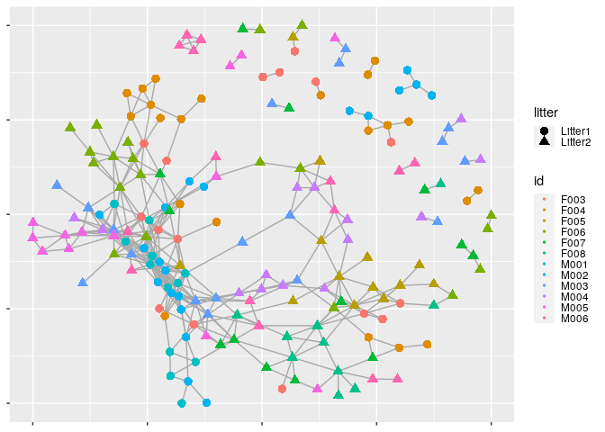<!-- --> Nous
voyons le réseau résultant dans la figure. Les couleurs de la figure
représentent la souris d’où provient l’échantillon et la forme
représente la portée dans laquelle se trouvait la souris. Nous pouvons
voir qu’il existe un regroupement des échantillons par souris et par
portée.

\#Tests à deux échantillons basés sur des graphiques \#\#Arbre couvrant
minimum (MST)

``` r
gt <- graph_perm_test(ps, "family_relationship", grouping = "host_subject_id",
                      distance = "jaccard", type = "mst")
gt$pva
```

    ## [1] 0.006

``` r
library(gridExtra)
plotNet1=plot_test_network(gt) + theme(legend.text = element_text(size = 8),
        legend.title = element_text(size = 9))
plotPerm1=plot_permutations(gt)
grid.arrange(ncol = 2,  plotNet1, plotPerm1)
```

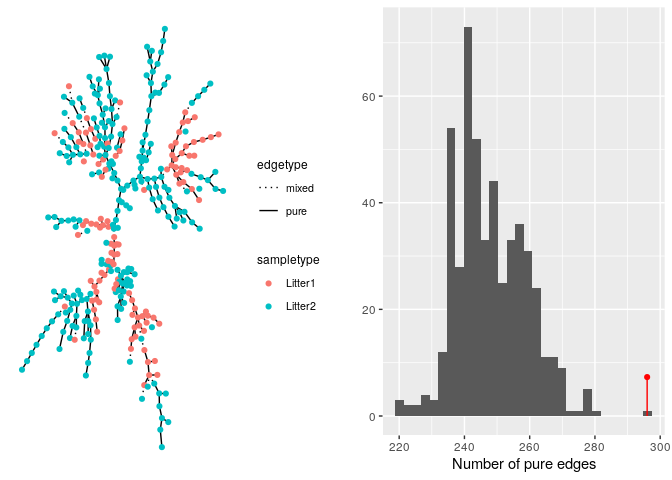<!-- --> Ce
test a un petit p-value, et nous rejetons l’hypothèse nulle que les deux
échantillons proviennent de la même distribution. À partir du graphique
de l’arbre couvrant minimum de la figure , nous voyons à l’œil nu que
les échantillons sont groupés par portée plus que ce à quoi nous nous
attendrions par hasard.

\#Voisins les plus proches

``` r
gt <- graph_perm_test(ps, "family_relationship", grouping = "host_subject_id",
                      distance = "jaccard", type = "knn", knn = 1)
```

``` r
plotNet2=plot_test_network(gt) + theme(legend.text = element_text(size = 8),
        legend.title = element_text(size = 9))
plotPerm2=plot_permutations(gt)
grid.arrange(ncol = 2,  plotNet2, plotPerm2)
```

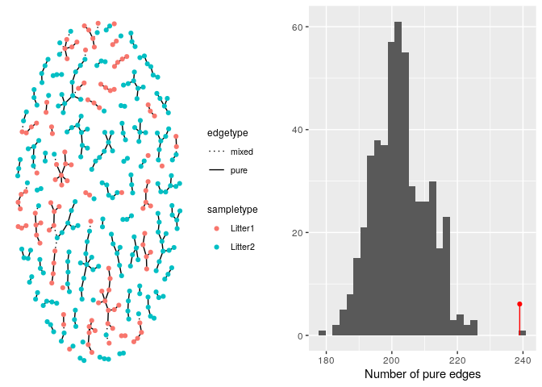<!-- --> Nous
voyons à partir de la figure au dessus que si une paire d’échantillons a
un bord entre eux dans le graphe du plus proche voisin, ils sont
extrêmement susceptibles d’être dans la même portée.

\#Modélisation linéaire \#\#calculons d’abord la diversité de Shannon
associée à chaque échantillon et la joignons avec l’annotation
d’échantillon.

``` r
library("nlme")
```

    ## 
    ## Attaching package: 'nlme'

    ## The following object is masked from 'package:dplyr':
    ## 
    ##     collapse

    ## The following object is masked from 'package:Biostrings':
    ## 
    ##     collapse

    ## The following object is masked from 'package:IRanges':
    ## 
    ##     collapse

``` r
library("reshape2")
ps_alpha_div <- estimate_richness(ps, split = TRUE, measure = "Shannon")
ps_alpha_div$SampleID <- rownames(ps_alpha_div) %>%
  as.factor()
ps_samp <- sample_data(ps) %>%
  unclass() %>%
  data.frame() %>%
  left_join(ps_alpha_div, by = "SampleID") %>%
  melt(measure.vars = "Shannon",
       variable.name = "diversity_measure",
       value.name = "alpha_diversity")

# reorder's facet from lowest to highest diversity
diversity_means <- ps_samp %>%
  group_by(host_subject_id) %>%
  summarise(mean_div = mean(alpha_diversity)) %>%
  arrange(mean_div)
```

    ## `summarise()` ungrouping output (override with `.groups` argument)

``` r
ps_samp$host_subject_id <- factor(ps_samp$host_subject_id)
#                                  diversity_means$host_subject_id)
```

``` r
alpha_div_model <- lme(fixed = alpha_diversity ~ age_binned, data = ps_samp,
                       random = ~ 1 | host_subject_id)
```

``` r
new_data <- expand.grid(host_subject_id = levels(ps_samp$host_subject_id),
                        age_binned = levels(ps_samp$age_binned))
new_data$pred <- predict(alpha_div_model, newdata = new_data)
X <- model.matrix(eval(eval(alpha_div_model$call$fixed)[-2]),
                  new_data[-ncol(new_data)])
pred_var_fixed <- diag(X %*% alpha_div_model$varFix %*% t(X))
new_data$pred_var <- pred_var_fixed + alpha_div_model$sigma ^ 2
```

``` r
ggplot(ps_samp %>% left_join(new_data)) +
  geom_errorbar(aes(x = age_binned, ymin = pred - 2 * sqrt(pred_var),
                    ymax = pred + 2 * sqrt(pred_var)),
                col = "#858585", size = .1) +
  geom_point(aes(x = age_binned, y = alpha_diversity,
                 col = family_relationship), size = 0.8) +
  facet_wrap(~host_subject_id) +
  scale_y_continuous(limits = c(2.4, 4.6), breaks = seq(0, 5, .5)) +
  scale_color_brewer(palette = "Set2") +
  labs(x = "Binned Age", y = "Shannon Diversity", color = "Litter") +
  guides(col = guide_legend(override.aes = list(size = 4))) +
  theme(panel.border = element_rect(color = "#787878", fill = alpha("white", 0)),
        axis.text.x = element_text(angle = -90, size = 6),
        axis.text.y = element_text(size = 6))
```

    ## Joining, by = c("host_subject_id", "age_binned")

<!-- -->

\#Hierarchical multiple testing \#\#identifier les microbes individuels
dont l’abondance est liée à des variables d’échantillons d’intérêt. Une
approche standard consiste à calculer une statistique de test pour
chaque bactérie individuellement, à mesurer son association avec les
caractéristiques de l’échantillon, puis à ajuster conjointementp-valeurs
pour garantir une limite supérieure de False Discovery Rate

``` r
library("reshape2")
library("DESeq2")
```

    ## Loading required package: GenomicRanges

    ## Loading required package: GenomeInfoDb

    ## Loading required package: SummarizedExperiment

    ## Loading required package: Biobase

    ## Welcome to Bioconductor
    ## 
    ##     Vignettes contain introductory material; view with
    ##     'browseVignettes()'. To cite Bioconductor, see
    ##     'citation("Biobase")', and for packages 'citation("pkgname")'.

    ## 
    ## Attaching package: 'Biobase'

    ## The following object is masked from 'package:phyloseq':
    ## 
    ##     sampleNames

    ## Loading required package: DelayedArray

    ## Loading required package: matrixStats

    ## 
    ## Attaching package: 'matrixStats'

    ## The following objects are masked from 'package:Biobase':
    ## 
    ##     anyMissing, rowMedians

    ## The following object is masked from 'package:dplyr':
    ## 
    ##     count

    ## 
    ## Attaching package: 'DelayedArray'

    ## The following objects are masked from 'package:matrixStats':
    ## 
    ##     colMaxs, colMins, colRanges, rowMaxs, rowMins, rowRanges

    ## The following object is masked from 'package:igraph':
    ## 
    ##     simplify

    ## The following objects are masked from 'package:base':
    ## 
    ##     aperm, apply, rowsum

``` r
#New version of DESeq2 needs special levels
sample_data(ps)$age_binned <- cut(sample_data(ps)$age,
                          breaks = c(0, 100, 200, 400))
levels(sample_data(ps)$age_binned) <- list(Young100="(0,100]", Mid100to200="(100,200]", Old200="(200,400]")
sample_data(ps)$family_relationship = gsub(" ", "", sample_data(ps)$family_relationship)
ps_dds <- phyloseq_to_deseq2(ps, design = ~ age_binned + family_relationship)
```

    ## converting counts to integer mode

    ## Warning in DESeqDataSet(se, design = design, ignoreRank): some variables in
    ## design formula are characters, converting to factors

``` r
# geometric mean, set to zero when all coordinates are zero
geo_mean_protected <- function(x) {
  if (all(x == 0)) {
    return (0)
  }
  exp(mean(log(x[x != 0])))
}

geoMeans <- apply(counts(ps_dds), 1, geo_mean_protected)
ps_dds <- estimateSizeFactors(ps_dds, geoMeans = geoMeans)
ps_dds <- estimateDispersions(ps_dds)
```

    ## gene-wise dispersion estimates

    ## mean-dispersion relationship

    ## final dispersion estimates

``` r
abund <- getVarianceStabilizedData(ps_dds)
```

``` r
short_names <- substr(rownames(abund), 1, 5)%>%
  make.names(unique = TRUE)
rownames(abund) <- short_names
```

``` r
abund_sums <- rbind(data.frame(sum = colSums(abund),
                               sample = colnames(abund),
                               type = "DESeq2"),
                    data.frame(sum = rowSums(otu_table(pslog)),
                               sample = rownames(otu_table(pslog)),
                               type = "log(1 + x)"))

ggplot(abund_sums) +
  geom_histogram(aes(x = sum), binwidth = 20) +
  facet_grid(type ~ .) +
  xlab("Total abundance within sample")
```

<!-- -->
C’est la motivation de l’utilisation d’une telle transformation, bien
que pour des dénombrements d’abondance élevés, elle soit équivalente au
log, pour des abondances inférieures et moyennes, elle n’écrase pas les
données et donne des résultats plus puissants. Le code ci-dessous
illustre la mécanique du calcul de la transformation de stabilisation de
la variance sur un objet.

\#La procédure de test hiérarchique nécessite des tests univariés pour
chaque groupe taxonomique de niveau supérieur, pas seulement pour toutes
les espèces. Une fonction d’assistance,, treePValuesest disponible pour
cela; il attend une edgelist encodant les relations parent-enfant, la
première ligne spécifiant le nœud racine.

``` r
library("structSSI")
el <- phy_tree(pslog)$edge
el0 <- el
el0 <- el0[nrow(el):1, ]
el_names <- c(short_names, seq_len(phy_tree(pslog)$Nnode))
el[, 1] <- el_names[el0[, 1]]
el[, 2] <- el_names[as.numeric(el0[, 2])]
unadj_p <- treePValues(el, abund, sample_data(pslog)$age_binned)
```

\#corriger p-valeur en utilisant la procédure de test hiérarchique. Les
résultats des tests sont garantis pour contrôler plusieurs variantes de
contrôle FDR, mais à des niveaux différents; nous reportons les détails
à (Benjamini et Yekutieli 2003; Benjamini et Bogomolov 2014; Sankaran
et Holmes 2014) .

``` r
hfdr_res <- hFDR.adjust(unadj_p, el, .75)
summary(hfdr_res)
```

    ## Number of hypotheses: 764 
    ## Number of tree discoveries: 579 
    ## Estimated tree FDR: 1 
    ## Number of tip discoveries: 280 
    ## Estimated tips FDR: 1 
    ## 
    ##  hFDR adjusted p-values: 
    ##                 unadjp         adjp adj.significance
    ## GCAAG.95  1.861873e-82 3.723745e-82              ***
    ## GCAAG.70  1.131975e-75 2.263950e-75              ***
    ## GCAAG.187 5.148758e-59 1.029752e-58              ***
    ## GCAAG.251 3.519276e-50 7.038553e-50              ***
    ## GCAAG.148 1.274481e-49 2.548962e-49              ***
    ## GCAAG.30  9.925218e-49 1.985044e-48              ***
    ## GCGAG.76  1.722591e-46 3.445183e-46              ***
    ## GCAAG.167 6.249050e-43 1.249810e-42              ***
    ## 255       8.785479e-40 1.757096e-39              ***
    ## GCAAG.64  2.727610e-36 5.455219e-36              ***
    ## [only 10 most significant hypotheses shown] 
    ## --- 
    ## Signif. codes:  0 '***' 0.015 '**' 0.15 '*' 0.75 '.' 1.5 '-' 1

\#\#interactive part: not run

``` r
plot(hfdr_res, height = 5000)
```

\#En parcourant l’arbre complet, il devient clair que l’association
entre le groupe d’âge et l’abondance bactérienne n’est présente que dans
quelques groupes taxonomiques isolés, mais qu’elle est assez forte dans
ces groupes. Pour contextualiser ces résultats, nous pouvons retrouver
l’identité taxinomique des hypothèses rejetées.

``` r
tax <- tax_table(pslog)[, c("Family", "Genus")] %>%
  data.frame()
tax$seq <- short_names
```

``` r
options(digits=3)
hfdr_res@p.vals$seq <- rownames(hfdr_res@p.vals)
tax %>%
  left_join(hfdr_res@p.vals) %>%
  arrange(adjp) %>% head(10)
```

    ## Joining, by = "seq"

    ##             Family            Genus       seq   unadjp     adjp
    ## 1  Lachnospiraceae             <NA>  GCAAG.95 1.86e-82 3.72e-82
    ## 2  Lachnospiraceae        Roseburia  GCAAG.70 1.13e-75 2.26e-75
    ## 3  Lachnospiraceae Clostridium_XlVa GCAAG.187 5.15e-59 1.03e-58
    ## 4  Lachnospiraceae             <NA> GCAAG.251 3.52e-50 7.04e-50
    ## 5  Lachnospiraceae Clostridium_XlVa GCAAG.148 1.27e-49 2.55e-49
    ## 6  Lachnospiraceae             <NA>  GCAAG.30 9.93e-49 1.99e-48
    ## 7  Ruminococcaceae     Ruminococcus  GCGAG.76 1.72e-46 3.45e-46
    ## 8  Lachnospiraceae Clostridium_XlVa GCAAG.167 6.25e-43 1.25e-42
    ## 9  Lachnospiraceae        Roseburia  GCAAG.64 2.73e-36 5.46e-36
    ## 10            <NA>             <NA>   GCAAG.1 5.22e-35 1.04e-34
    ##    adj.significance
    ## 1               ***
    ## 2               ***
    ## 3               ***
    ## 4               ***
    ## 5               ***
    ## 6               ***
    ## 7               ***
    ## 8               ***
    ## 9               ***
    ## 10              ***

Il semble que les bactéries les plus fortement associées appartiennent
toutes à la famille des Lachnospiracées , ce qui est cohérent avec les
résultats aléatoires de la forêt.

\#Techniques polyvalentes

``` r
metab <- read.csv("https://raw.githubusercontent.com/spholmes/F1000_workflow/master/data/metabolites.csv",row.names = 1)
microbe_connect <-url("https://raw.githubusercontent.com/spholmes/F1000_workflow/master/data/microbe.rda")
load(microbe_connect)
microbe
```

    ## phyloseq-class experiment-level object
    ## otu_table()   OTU Table:         [ 20609 taxa and 12 samples ]
    ## tax_table()   Taxonomy Table:    [ 20609 taxa by 6 taxonomic ranks ]
    ## phy_tree()    Phylogenetic Tree: [ 20609 tips and 20607 internal nodes ]

Nous voyons que microbec’est un phyloseqobjet. Notre prétraitement
reflète celui des données de la souris. Nous filtrons d’abord les
microbes et les métabolites d’intérêt, en supprimant ceux qui sont nuls
sur de nombreux échantillons. Ensuite, nous les transformons pour
affaiblir les queues lourdes. Nous prenons également le journal des
métabolites.

\#Appliquer une CCA clairsemée. Cette méthode compare des ensembles
d’entités dans des tables de données de grande dimension, où il peut y
avoir plus d’entités mesurées que d’échantillons.

``` r
library("genefilter")
```

    ## 
    ## Attaching package: 'genefilter'

    ## The following objects are masked from 'package:matrixStats':
    ## 
    ##     rowSds, rowVars

``` r
keep_ix <- rowSums(metab == 0) <= 3
metab <- metab[keep_ix, ]
microbe <- prune_taxa(taxa_sums(microbe) > 4, microbe)
microbe <- filter_taxa(microbe, filterfun(kOverA(3, 2)), TRUE)
metab <- log(1 + metab, base = 10)
X <- otu_table(microbe)
X[X > 50] <- 50
dim(X)
```

    ## [1] 174  12

``` r
dim(metab)
```

    ## [1] 405  12

\#ppliquer une CCA clairsemée. Cette méthode compare des ensembles
d’entités dans des tables de données de grande dimension, où il peut y
avoir plus d’entités mesurées que d’échantillons

``` r
library(PMA)
cca_res <- CCA(t(X),  t(metab), penaltyx = .15, penaltyz = .15)
```

    ## 123456789101112131415

``` r
cca_res
```

    ## Call: CCA(x = t(X), z = t(metab), penaltyx = 0.15, penaltyz = 0.15)
    ## 
    ## 
    ## Num non-zeros u's:  5 
    ## Num non-zeros v's:  15 
    ## Type of x:  standard 
    ## Type of z:  standard 
    ## Penalty for x: L1 bound is  0.15 
    ## Penalty for z: L1 bound is  0.15 
    ## Cor(Xu,Zv):  0.974

\#utiliser ces 20 fonctionnalités pour compresser les informations des
deux tables sans trop de pertes. Pour relier les métabolites et OTU
récupérés aux caractéristiques des échantillons sur lesquels ils ont
été mesurés, nous les utilisons comme intrants dans un PCA ordinaire.

``` r
combined <- cbind(t(X[cca_res$u != 0, ]),
                  t(metab[cca_res$v != 0, ]))
pca_res <- dudi.pca(combined, scannf = F, nf = 3)
```

``` r
genotype <- substr(rownames(pca_res$li), 1, 2)
sample_type <- substr(rownames(pca_res$l1), 3, 4)
feature_type <- grepl("\\.", colnames(combined))
feature_type <- ifelse(feature_type, "Metabolite", "OTU")
sample_info <- data.frame(pca_res$li, genotype, sample_type)
feature_info <- data.frame(pca_res$c1,
                           feature = substr(colnames(combined), 1, 6))
```

``` r
ggplot() +  geom_point(data = sample_info,
            aes(x = Axis1, y = Axis2, col = sample_type, shape = genotype), size = 3) + 
  geom_label_repel(data = feature_info,
                   aes(x = 5.5 * CS1, y = 5.5 * CS2, label = feature, fill = feature_type),
                   size = 2, segment.size = 0.3,
                   label.padding = unit(0.1, "lines"), label.size = 0) +
  geom_point(data = feature_info,
             aes(x = 5.5 * CS1, y = 5.5 * CS2, fill = feature_type),
             size = 1, shape = 23, col = "#383838") +
  scale_color_brewer(palette = "Set2") +
  scale_fill_manual(values = c("#a6d854", "#e78ac3")) +
  guides(fill = guide_legend(override.aes = list(shape = 32, size = 0))) +
  coord_fixed(sqrt(pca_res$eig[2] / pca_res$eig[2])) +
  labs(x = sprintf("Axis1 [%s%% Variance]",
                   100 * round(pca_res$eig[1] / sum(pca_res$eig), 2)),
       y = sprintf("Axis2 [%s%% Variance]",
                   100 * round(pca_res$eig[2] / sum(pca_res$eig), 2)),
       fill = "Feature Type", col = "Sample Type")
```

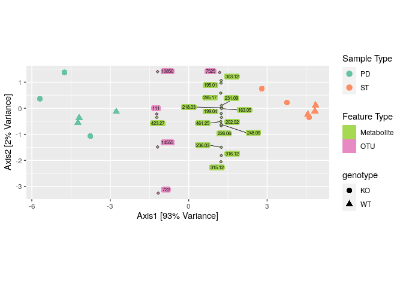<!-- --> Un
triplot PCA produit à partir des caractéristiques sélectionnées par
l’ACC à partir de plusieurs types de données; métabolites et OTU La
figure affiche un triplot PCA , où nous montrons différents types
d’échantillons et les caractéristiques multidomaines (métabolites et
OTU). Cela permet une comparaison entre les échantillons mesurés -
triangles pour Knockout et cercles pour le type sauvage - et caractérise
l’influence des différentes caractéristiques - des losanges avec des
étiquettes de texte. Par exemple, nous voyons que la principale
variation des données se situe entre les échantillons PD et ST, qui
correspondent aux différents régimes.

En outre, de grandes valeurs de 15 des caractéristiques sont associées à
l’état ST, tandis que de petites valeurs pour 5 d’entre elles indiquent
l’état PD. L’avantage du criblage CCA clairsemé est maintenant clair:
nous pouvons afficher la plupart des variations entre les échantillons à
l’aide d’un tracé relativement simple, et pouvons éviter de tracer les
centaines de points supplémentaires qui seraient nécessaires pour
afficher toutes les caractéristiques.

``` r
devtools::session_info()
```

    ## ─ Session info ───────────────────────────────────────────────────────────────
    ##  setting  value                       
    ##  version  R version 4.0.3 (2020-10-10)
    ##  os       Ubuntu 20.04 LTS            
    ##  system   x86_64, linux-gnu           
    ##  ui       X11                         
    ##  language (EN)                        
    ##  collate  en_US.UTF-8                 
    ##  ctype    en_US.UTF-8                 
    ##  tz       Etc/UTC                     
    ##  date     2020-11-27                  
    ## 
    ## ─ Packages ───────────────────────────────────────────────────────────────────
    ##  package              * version    date       lib
    ##  ade4                 * 1.7-16     2020-10-28 [1]
    ##  annotate               1.66.0     2020-04-27 [1]
    ##  AnnotationDbi          1.50.3     2020-07-25 [1]
    ##  ape                    5.4-1      2020-08-13 [1]
    ##  assertthat             0.2.1      2019-03-21 [1]
    ##  Biobase              * 2.48.0     2020-04-27 [1]
    ##  BiocGenerics         * 0.34.0     2020-04-27 [1]
    ##  BiocManager            1.30.10    2019-11-16 [1]
    ##  BiocParallel           1.22.0     2020-04-27 [1]
    ##  biomformat             1.16.0     2020-04-27 [1]
    ##  Biostrings           * 2.56.0     2020-04-27 [1]
    ##  bit                    4.0.4      2020-08-04 [1]
    ##  bit64                  4.0.5      2020-08-30 [1]
    ##  bitops                 1.0-6      2013-08-17 [1]
    ##  blob                   1.2.1      2020-01-20 [1]
    ##  callr                  3.5.1      2020-10-13 [1]
    ##  caret                * 6.0-86     2020-03-20 [1]
    ##  class                  7.3-17     2020-04-26 [2]
    ##  cli                    2.2.0      2020-11-20 [1]
    ##  cluster                2.1.0      2019-06-19 [2]
    ##  codetools              0.2-16     2018-12-24 [2]
    ##  colorspace             2.0-0      2020-11-11 [1]
    ##  crayon                 1.3.4      2017-09-16 [1]
    ##  curl                   4.3        2019-12-02 [1]
    ##  data.table             1.13.2     2020-10-19 [1]
    ##  DBI                    1.1.0      2019-12-15 [1]
    ##  DelayedArray         * 0.14.1     2020-07-14 [1]
    ##  desc                   1.2.0      2018-05-01 [1]
    ##  DESeq2               * 1.28.1     2020-05-12 [1]
    ##  devtools               2.3.2      2020-09-18 [1]
    ##  digest                 0.6.27     2020-10-24 [1]
    ##  dplyr                * 1.0.2      2020-08-18 [1]
    ##  e1071                  1.7-4      2020-10-14 [1]
    ##  ellipsis               0.3.1      2020-05-15 [1]
    ##  evaluate               0.14       2019-05-28 [1]
    ##  fansi                  0.4.1      2020-01-08 [1]
    ##  farver                 2.0.3      2020-01-16 [1]
    ##  foreach                1.5.1      2020-10-15 [1]
    ##  fs                     1.5.0      2020-07-31 [1]
    ##  genefilter           * 1.70.0     2020-04-27 [1]
    ##  geneplotter            1.66.0     2020-04-27 [1]
    ##  generics               0.1.0      2020-10-31 [1]
    ##  GenomeInfoDb         * 1.24.2     2020-06-15 [1]
    ##  GenomeInfoDbData       1.2.3      2020-11-19 [1]
    ##  GenomicRanges        * 1.40.0     2020-04-27 [1]
    ##  ggnetwork            * 0.5.8      2020-02-12 [1]
    ##  ggplot2              * 3.3.2      2020-06-19 [1]
    ##  ggrepel              * 0.8.2      2020-03-08 [1]
    ##  glue                   1.4.2      2020-08-27 [1]
    ##  gower                  0.2.2      2020-06-23 [1]
    ##  gridExtra            * 2.3        2017-09-09 [1]
    ##  gtable                 0.3.0      2019-03-25 [1]
    ##  hms                    0.5.3      2020-01-08 [1]
    ##  htmltools              0.5.0      2020-06-16 [1]
    ##  igraph               * 1.2.6      2020-10-06 [1]
    ##  ipred                  0.9-9      2019-04-28 [1]
    ##  IRanges              * 2.22.2     2020-05-21 [1]
    ##  iterators              1.0.13     2020-10-15 [1]
    ##  jsonlite               1.7.1      2020-09-07 [1]
    ##  knitr                * 1.30       2020-09-22 [1]
    ##  labeling               0.4.2      2020-10-20 [1]
    ##  lattice              * 0.20-41    2020-04-02 [2]
    ##  lava                   1.6.8.1    2020-11-04 [1]
    ##  lifecycle              0.2.0      2020-03-06 [1]
    ##  locfit                 1.5-9.4    2020-03-25 [1]
    ##  lubridate              1.7.9.2    2020-11-13 [1]
    ##  magrittr               2.0.1      2020-11-17 [1]
    ##  markdown             * 1.1        2019-08-07 [1]
    ##  MASS                   7.3-53     2020-09-09 [2]
    ##  Matrix                 1.2-18     2019-11-27 [2]
    ##  matrixStats          * 0.57.0     2020-09-25 [1]
    ##  memoise                1.1.0      2017-04-21 [1]
    ##  mgcv                   1.8-33     2020-08-27 [2]
    ##  ModelMetrics           1.2.2.2    2020-03-17 [1]
    ##  multtest               2.44.0     2020-04-27 [1]
    ##  munsell                0.5.0      2018-06-12 [1]
    ##  nlme                 * 3.1-150    2020-10-24 [1]
    ##  nnet                   7.3-14     2020-04-26 [2]
    ##  permute              * 0.9-5      2019-03-12 [1]
    ##  phyloseq             * 1.32.0     2020-04-27 [1]
    ##  phyloseqGraphTest    * 0.1.0      2020-11-18 [1]
    ##  pillar                 1.4.7      2020-11-20 [1]
    ##  pkgbuild               1.1.0      2020-07-13 [1]
    ##  pkgconfig              2.0.3      2019-09-22 [1]
    ##  pkgload                1.1.0      2020-05-29 [1]
    ##  pls                    2.7-3      2020-08-07 [1]
    ##  plyr                   1.8.6      2020-03-03 [1]
    ##  PMA                  * 1.2.1      2020-02-03 [1]
    ##  prettyunits            1.1.1      2020-01-24 [1]
    ##  pROC                   1.16.2     2020-03-19 [1]
    ##  processx               3.4.4      2020-09-03 [1]
    ##  prodlim                2019.11.13 2019-11-17 [1]
    ##  progress               1.2.2      2019-05-16 [1]
    ##  ps                     1.4.0      2020-10-07 [1]
    ##  purrr                  0.3.4      2020-04-17 [1]
    ##  R6                     2.5.0      2020-10-28 [1]
    ##  randomForest         * 4.6-14     2018-03-25 [1]
    ##  RColorBrewer           1.1-2      2014-12-07 [1]
    ##  Rcpp                   1.0.5      2020-07-06 [1]
    ##  RCurl                  1.98-1.2   2020-04-18 [1]
    ##  recipes                0.1.15     2020-11-11 [1]
    ##  remotes                2.2.0      2020-07-21 [1]
    ##  reshape2             * 1.4.4      2020-04-09 [1]
    ##  rhdf5                  2.32.4     2020-10-05 [1]
    ##  Rhdf5lib               1.10.1     2020-07-09 [1]
    ##  rjson                  0.2.20     2018-06-08 [1]
    ##  rlang                  0.4.8      2020-10-08 [1]
    ##  rmarkdown              2.5        2020-10-21 [1]
    ##  rpart                  4.1-15     2019-04-12 [2]
    ##  rprojroot              2.0.2      2020-11-15 [1]
    ##  RSQLite                2.2.1      2020-09-30 [1]
    ##  S4Vectors            * 0.26.1     2020-05-16 [1]
    ##  scales                 1.1.1      2020-05-11 [1]
    ##  sessioninfo            1.1.1      2018-11-05 [1]
    ##  stringi                1.5.3      2020-09-09 [1]
    ##  stringr                1.4.0      2019-02-10 [1]
    ##  structSSI            * 1.1.1      2015-05-05 [1]
    ##  SummarizedExperiment * 1.18.2     2020-07-09 [1]
    ##  survival               3.2-7      2020-09-28 [2]
    ##  testthat               3.0.0      2020-10-31 [1]
    ##  tibble                 3.0.4      2020-10-12 [1]
    ##  tidyselect             1.1.0      2020-05-11 [1]
    ##  timeDate               3043.102   2018-02-21 [1]
    ##  usethis                1.6.3      2020-09-17 [1]
    ##  vctrs                  0.3.5      2020-11-17 [1]
    ##  vegan                * 2.5-6      2019-09-01 [1]
    ##  viridisLite          * 0.3.0      2018-02-01 [1]
    ##  withr                  2.3.0      2020-09-22 [1]
    ##  xfun                   0.19       2020-10-30 [1]
    ##  XML                    3.99-0.5   2020-07-23 [1]
    ##  xtable                 1.8-4      2019-04-21 [1]
    ##  XVector              * 0.28.0     2020-04-27 [1]
    ##  yaml                   2.2.1      2020-02-01 [1]
    ##  zlibbioc               1.34.0     2020-04-27 [1]
    ##  source                                      
    ##  RSPM (R 4.0.3)                              
    ##  Bioconductor                                
    ##  Bioconductor                                
    ##  RSPM (R 4.0.2)                              
    ##  RSPM (R 4.0.0)                              
    ##  Bioconductor                                
    ##  Bioconductor                                
    ##  RSPM (R 4.0.0)                              
    ##  Bioconductor                                
    ##  Bioconductor                                
    ##  Bioconductor                                
    ##  RSPM (R 4.0.2)                              
    ##  RSPM (R 4.0.2)                              
    ##  RSPM (R 4.0.0)                              
    ##  RSPM (R 4.0.0)                              
    ##  RSPM (R 4.0.2)                              
    ##  RSPM (R 4.0.0)                              
    ##  CRAN (R 4.0.3)                              
    ##  RSPM (R 4.0.3)                              
    ##  CRAN (R 4.0.3)                              
    ##  CRAN (R 4.0.3)                              
    ##  RSPM (R 4.0.3)                              
    ##  RSPM (R 4.0.0)                              
    ##  RSPM (R 4.0.0)                              
    ##  RSPM (R 4.0.3)                              
    ##  RSPM (R 4.0.0)                              
    ##  Bioconductor                                
    ##  RSPM (R 4.0.0)                              
    ##  Bioconductor                                
    ##  RSPM (R 4.0.2)                              
    ##  RSPM (R 4.0.3)                              
    ##  RSPM (R 4.0.2)                              
    ##  RSPM (R 4.0.2)                              
    ##  RSPM (R 4.0.0)                              
    ##  RSPM (R 4.0.0)                              
    ##  RSPM (R 4.0.0)                              
    ##  RSPM (R 4.0.0)                              
    ##  RSPM (R 4.0.2)                              
    ##  RSPM (R 4.0.2)                              
    ##  Bioconductor                                
    ##  Bioconductor                                
    ##  RSPM (R 4.0.3)                              
    ##  Bioconductor                                
    ##  Bioconductor                                
    ##  Bioconductor                                
    ##  RSPM (R 4.0.0)                              
    ##  RSPM (R 4.0.1)                              
    ##  RSPM (R 4.0.2)                              
    ##  RSPM (R 4.0.2)                              
    ##  CRAN (R 4.0.3)                              
    ##  RSPM (R 4.0.0)                              
    ##  RSPM (R 4.0.0)                              
    ##  RSPM (R 4.0.0)                              
    ##  RSPM (R 4.0.1)                              
    ##  RSPM (R 4.0.2)                              
    ##  CRAN (R 4.0.3)                              
    ##  Bioconductor                                
    ##  RSPM (R 4.0.2)                              
    ##  RSPM (R 4.0.2)                              
    ##  RSPM (R 4.0.2)                              
    ##  RSPM (R 4.0.3)                              
    ##  CRAN (R 4.0.3)                              
    ##  CRAN (R 4.0.3)                              
    ##  RSPM (R 4.0.0)                              
    ##  RSPM (R 4.0.0)                              
    ##  RSPM (R 4.0.3)                              
    ##  RSPM (R 4.0.3)                              
    ##  RSPM (R 4.0.0)                              
    ##  CRAN (R 4.0.3)                              
    ##  CRAN (R 4.0.3)                              
    ##  RSPM (R 4.0.2)                              
    ##  RSPM (R 4.0.0)                              
    ##  CRAN (R 4.0.3)                              
    ##  CRAN (R 4.0.3)                              
    ##  Bioconductor                                
    ##  RSPM (R 4.0.0)                              
    ##  RSPM (R 4.0.3)                              
    ##  CRAN (R 4.0.3)                              
    ##  RSPM (R 4.0.0)                              
    ##  Bioconductor                                
    ##  Github (jfukuyama/phyloseqGraphTest@3fb6c27)
    ##  RSPM (R 4.0.3)                              
    ##  RSPM (R 4.0.2)                              
    ##  RSPM (R 4.0.0)                              
    ##  RSPM (R 4.0.0)                              
    ##  RSPM (R 4.0.2)                              
    ##  RSPM (R 4.0.2)                              
    ##  RSPM (R 4.0.0)                              
    ##  RSPM (R 4.0.0)                              
    ##  CRAN (R 4.0.3)                              
    ##  RSPM (R 4.0.2)                              
    ##  CRAN (R 4.0.3)                              
    ##  RSPM (R 4.0.0)                              
    ##  RSPM (R 4.0.2)                              
    ##  RSPM (R 4.0.0)                              
    ##  RSPM (R 4.0.3)                              
    ##  RSPM (R 4.0.0)                              
    ##  RSPM (R 4.0.0)                              
    ##  RSPM (R 4.0.2)                              
    ##  RSPM (R 4.0.0)                              
    ##  CRAN (R 4.0.3)                              
    ##  RSPM (R 4.0.2)                              
    ##  RSPM (R 4.0.2)                              
    ##  Bioconductor                                
    ##  Bioconductor                                
    ##  RSPM (R 4.0.0)                              
    ##  RSPM (R 4.0.2)                              
    ##  RSPM (R 4.0.3)                              
    ##  CRAN (R 4.0.3)                              
    ##  RSPM (R 4.0.3)                              
    ##  RSPM (R 4.0.2)                              
    ##  Bioconductor                                
    ##  RSPM (R 4.0.0)                              
    ##  RSPM (R 4.0.0)                              
    ##  RSPM (R 4.0.2)                              
    ##  RSPM (R 4.0.0)                              
    ##  local                                       
    ##  Bioconductor                                
    ##  CRAN (R 4.0.3)                              
    ##  RSPM (R 4.0.3)                              
    ##  RSPM (R 4.0.2)                              
    ##  RSPM (R 4.0.3)                              
    ##  CRAN (R 4.0.3)                              
    ##  RSPM (R 4.0.2)                              
    ##  RSPM (R 4.0.3)                              
    ##  RSPM (R 4.0.0)                              
    ##  RSPM (R 4.0.0)                              
    ##  RSPM (R 4.0.2)                              
    ##  RSPM (R 4.0.3)                              
    ##  RSPM (R 4.0.2)                              
    ##  CRAN (R 4.0.3)                              
    ##  Bioconductor                                
    ##  RSPM (R 4.0.0)                              
    ##  Bioconductor                                
    ## 
    ## [1] /usr/local/lib/R/site-library
    ## [2] /usr/local/lib/R/library

``` r
save.image (file = "my_work_space.RData")
```

``` r
load("my_work_space.RData")
library (tidyverse)
```

    ## ── Attaching packages ─────────────────────────────────────── tidyverse 1.3.0 ──

    ## ✓ tibble  3.0.4     ✓ purrr   0.3.4
    ## ✓ tidyr   1.1.2     ✓ stringr 1.4.0
    ## ✓ readr   1.4.0     ✓ forcats 0.5.0

    ## ── Conflicts ────────────────────────────────────────── tidyverse_conflicts() ──
    ## x tibble::as_data_frame() masks igraph::as_data_frame(), dplyr::as_data_frame()
    ## x nlme::collapse()        masks dplyr::collapse(), Biostrings::collapse(), IRanges::collapse()
    ## x Biobase::combine()      masks randomForest::combine(), dplyr::combine(), gridExtra::combine(), BiocGenerics::combine()
    ## x purrr::compact()        masks XVector::compact()
    ## x purrr::compose()        masks igraph::compose()
    ## x matrixStats::count()    masks dplyr::count()
    ## x tidyr::crossing()       masks igraph::crossing()
    ## x dplyr::desc()           masks IRanges::desc()
    ## x tidyr::expand()         masks S4Vectors::expand()
    ## x dplyr::filter()         masks stats::filter()
    ## x dplyr::first()          masks S4Vectors::first()
    ## x igraph::groups()        masks dplyr::groups()
    ## x dplyr::lag()            masks stats::lag()
    ## x purrr::lift()           masks caret::lift()
    ## x randomForest::margin()  masks ggplot2::margin()
    ## x ggplot2::Position()     masks BiocGenerics::Position(), base::Position()
    ## x purrr::reduce()         masks GenomicRanges::reduce(), IRanges::reduce()
    ## x dplyr::rename()         masks S4Vectors::rename()
    ## x purrr::simplify()       masks DelayedArray::simplify(), igraph::simplify()
    ## x dplyr::slice()          masks XVector::slice(), IRanges::slice()
    ## x readr::spec()           masks genefilter::spec()
